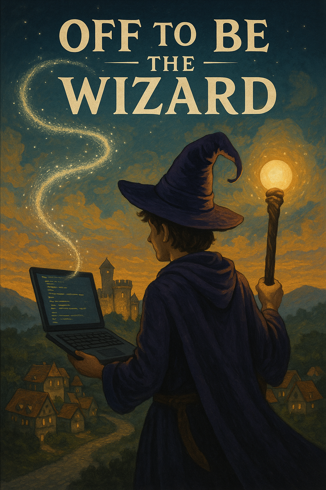

[Work With Me](../resume_page.md), [Projects](../projects.md), [Blog](../blog.md)

# My Book Recommendations
As an avid audible listener I've got to say my library has grown continually for the however many years I've actually been a member. Far faster than the 1 Book per month that the default subscription would imply. 166 Titles would imply I'd been a member for almost 14 years. 

## Off to be the Wizard (Magic 2.0)

Scott Meyer the author of the book series has a nack for unique takes on older concepts. It's definitely a series which gets a lot of extra leg room in the audio book as some of the descriptions can be a little less descriptive than I'd typically want, but with Luke Denis narrating it's a great listen. I enjoyed it up until the 5th book where the writing of the magical people started to drift away into areas that made some sections difficult to listen to. Without spoiling anything, one of the main characters repeatedly makes an unmagically gifted person go get food and prepare it for them, when they could literally just pull it out of their hat. Despite having promised to provide it on mulitple ocassions. 

- Off to Be the Wizard
- Spell or High Water
- An Unwelcome Quest
- Fight or Flight
- Out of Spite, Out of Mind (And this is where the series kinda lost me)
- The Vexed Generation 

Overall definitely worth a read. My brother showed me the kindle version which has animated illustrations at points, making the book a fun read or listen.

## Master of Formalities
Another Scott Meyer book which has an interesting take on an old concept. It definitely shows that he had gained a lot of writing experience during the process of the first couple Off to be the Wizard books, and honestly it was enjoyable, if a bit slow to get started. This one doesn't start a series so it's a substantially smaller commitment than the Magic 2.0 series at only a single 15 hour listen. Without spoiling, think the perspective of the butlers in an interstellar human empire where cultures have vastly diverged. 

## Bobiverse
The original trilogy is a delightfully well put together arc with great story and characters. The new books which are still coming out, I'm waiting with baited breath on each of them. Well some of the decisions the Denis e. Taylor made in the book would frustrate those who had contradictory head cannons, the answers are good enough and the characters are still enjoyable enough to make the additional books feel worthy of the original trilogy. Definitely a must read/ listen science fiction experience. If you look at the authors blog he has mentioned that it has been picked up for an option on a TV series. Honestly if it could get the budget to do it justice, I think it could make a great movie series, so I'm hyped to see if anything ever comes of that. 

- We are Legion (We are Bob)
- For We are Many
- All These Worlds

- Heaven's River
- Not Till We are Lost 

and hopefully more to come. If this series turns into Denis e. Taylor's forever series getting more and more material fleshing out and expanding the cannon, I'll be a happy fan for as long as they keep coming out. 

## Quantum Earth
Another great Denis e. Taylor series. This one is definitely less beloved, but still a great pair of books. With more almost definitely to come. I think the reason why this series is less beloved than the Bobiverse series is likely that it ocassionally hits a bit too close to home. Especially the second book. Without spoiling too much, think the tv show sliders, but with a much less populated universe. I'll continue to listen to these books, but I hope that a good plot thread can be added to remove the problem of the week feeling that the books could certainly drift towards. That or that the series will fully dive into that direction digging in and going the Martian or more level of detail on its solutions.

- Outland 
- Earthside

I think the titles give you some idea as to what's going on in the series. But I've been careful to not spoil anything significantly plote relevant. 

## Roadkill
This book should go problem of the week series, if it ever gets a series. It is nice well contained little plot with no need for more. But I'd still probably tune in to listen to more. I'll leave this one entirely spoiler free as I can't think of a way to give a hint without substantial spoilers here. Definitely some more classic Denis e. Taylor.

## The Singularity Trap
Great book, another Denis e. Taylor special. Honestly don't want a sequel to it, because it is so neatly well contained with no great plot hooks for future stories. A great answer to the Fermi Paradox. I will say this is the one book by this author that I haven't felt the compunction to re-listen to, not that's bad, it's great, just not something that really needs repeating.

## Feedback
An engaging 30 minute science fiction special by Denis e. Taylor. A delightful version of the trope of paradoxes in science fiction with some fun concequences and patterns that had me listening to the story at least 3 times. Bite size fun, but worth every second of it. I had it on as background and had to pause it because I ended up stopping what I was supposed to be working on.

## The Wandering Inn
Prior to this series I was not a fan of the LitRPG genre. The setup where the characters are in a world more of less governed by video game logic. With levels, and skills, and magic. But the wondering inn drew me in with its engaging characters and slowly building tension over the course of the series. 

- The Wandering Inn
- Fae and Fare
- Flowers of Esthelm
- Winter Solstice
- The Last Light
- The General of Izril
- Rains of Liscor
- Blood of Liscor
- Tears of Liscor
- The Wind Runner
- The Titan of Baleros
- The Witch of Webs

Written by Pirate Aba the series is getting ever longer but so far without running out of lore to power it. In fact there's a new series in the same universe starting called Gravesong, starting its plot on a different continent and telling the story with another character at the center of it all. It's always a series that I have to pace myself on, despite the roughly 40 hours of audio in each book. 

## The Singer of Terandria
I've got to dig into this series more as it's set in the same universe as the other Pirate Aba books that I've litened to; however, I just don't find the protagonist particularly engaging. If they were a subprotagonist within the exisitng wondering inn series I could forgive it as their story getting built up. New characters can get a lot of slack when we can cut away to the old one. However, in a new series I can't offer that same forgiveness. 

In the wondering inn they have a character that is a hot head and gets into fights unnecessarily. But that's part of their character. They are a hot head and they grow as you move through the books until by Wind Runner an entire book can be focussed on them without me wanting to stop listening. Grave Signer doesn't have this same level of forgiveness as the main character has a problem with authority that leads them to start fights with people they rely on when those people have done less than nothing to start the battle. A little bit before you realize what type of world you've found yourself in is forgivable; however, after the character has gotten the lay of the land being stauchly anti-monarachy in a monarchy and blindly refusing people when they have the power to help you is as dumb as can be. Hopefully the second book in the series can somewhat revive this continent of the wandering inn universe to make the story a might less infuriating to listen to.

## The Three-Body Problem
An excellent book and now an excellent television series. The book was written by Cinxin Liu and was translated into english from its original language. It has an engaging science fiction world with a story that attempts to give an answer to the Fermi paradox. The first book was narrated by the excellent voices of Luke Daniels, the second book, which is for now where I've left the series is narrated by the much less enjoyable P.J. Ochlan. The contrast between the two voices in terms of their ability to give clear life to the characters is startiling, but I will likly pick the series back up again when I reach the point in the netflix special where book 2 ends. 

## The Expanse Series
I need to get back into this particular series as my interest started to wain when I started having to wait for books to be published. For some reason I couldn't bring myself to go to the novella companions on this one to expand the canon material out to a grand total of 20 books. 

- Leviathan Wakes
- Caliban's War
- Abaddon's Gate
- Cibola Burn
- Nemisis Games
- Babylon's Ashes
- Persepolis Rising
- Tiamat's Wrath
- Then I have Leviathan Falls, but still need to listen to it. When will that end up happening I don't know.

## Expeditionary Force
The Beer Can that saves the world. A great science fiction romp that has enough popularity that I've started picking up references to the series in other sources. And there's a really obviouos and direct reference to it in the 4th book of the bobiverse book 4.

- Columbus Day
- Spec Ops
- Paradise
- Trouble on Paradise
- Black Ops
- Zero Hour
- Mavericks
- Renegades

I have several more books in the series to go through so I'l lhold off on forming a final opinion, but suffice to say if I've managed to get 8 books deep it's safe to say I enjoy the series. 

## The First Fifteen Lives of Harry August
What if you die and get a do over. Or as many do overs as you want with all of the foreknowledge that comes from having lived your life a time before. I think we've basically all had the thought of going back some years and trying out those paths less traveled, or all the paths that you could have. It's a interesting concept to make a series out of, and explored in a way that while definitely satisfying left me feeling less comfortable in the answer than I would have liked. 

## CivCEO: Accidental Champion Series
Another romp in the LitRPG world. The interesting concept in this one, is the person drawn into the fantasy world is a grumpy old CEO with a heart of gold. 

- CivCEO 1
- CivCEO 2
- CivCEO 3
- CivCEO 4
- CivCEO 5
- CivCEO 6
- CivCEO 7
- CivCEO 8

Why the author didn't feel the need to title their books beyond numbering them is something that is beyond me. Especially when there is definite broad themes to each of the books. That being said my only advice here is to speed run these books as fast as you can. If you give them any time to sit then you'll realize that the author is not actually all that good, despite the winning concept. 

From the main character always winning, or at the least only having minimal set backs to their plans. To the plot holes where the character references things that they shouldn't really know about. It's a bit frustrating to enjoy the book. Even the books timeline is left vague, and events occur at no well defined speed once the series gets past its initial setup. There is a slight attempt to explain the timeline at the end of the series; however, it's a general oh yeah everything is timeless here...

## Singularity Series
Just think if ChatGPT genuinely did gain sentience. It might not be the prettiest for us, or it could negotiate peace and the perfect eco friendly economy. It's a serious gamble.

- Avogadro Corp (Yeah it's a funny play on reality)
- A.I. Apocalypse
- The Last Firewall
- The Turing Exception

The second book bothered me for the rest of the series. Without spoiling too much:

  
Major Spoiler warning

  
The main character commits what is effectivly Xenocide against a new species. And is then praised as a hero by both humanity (Who justifiably hate the new species), and another new species who I feel should rightfully look on him as a horrifying monster. And as a run on concequence of this person's designs and actions humans end up as cargo container of computational gum sticks floating into deep space with their memories modified to no longer reflect the true nature of their reality, instead believing they live in a perfectly normal AI free world.
  

## Ready Player One
By Ernest Cline, it's the only book of his that I've listened to. It's pretty enteretaining, but nothing super special. A nostalgic romp through nerd history with references around every bend. It's not a bad book by any means, and it was a fun movie. But it's extremely telling that I haven't thought about it in ernest between now and when I read it last. I listened to the majority of the 15 hour book over the course of driving down from Lloydminster to Calgary, and driving back up from Calgary to Lloydminster during my engineering internship. The fact that it was enough to keep my attention for the full driving time is a sign that it is indeed a reasonably good book.

## Starter Villain
John Scalzi you're a delight. This book was entertaining from start to finish with a silly but fun plot which kept me listening. At only an 8 hour listen it's not the longest novel out there, but that keeps it bight sized and enjoyable. I particularly loved the descritpion of how money actauly works in the context of the story, and the fundamental motivations of the "Villian"? 