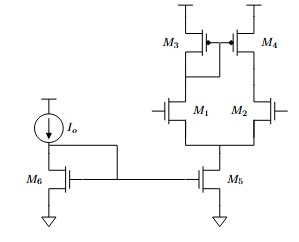

[Work With Me](../../resume_page.md) [Projects](../../projects.md), [Blog](../../blog.md)

# March 14 2026
Happy Pi Day Everyone. 

Having some fun and making prettier diagrams utilizing CircuitTikz.

```latex
\begin{tikzpicture}
	% Paths, nodes and wires:
	\node[nmos](N1) at (9, 5){} node[anchor=west] at (N1.text){$M_1$};
	\node[nmos, xscale=-1, yscale=-1](N2) at (11, 5){} node[anchor=east] at (N2.text){$M_2$};
	\node[nmos](N3) at (10, 3){} node[anchor=west] at (N3.text){$M_5$};
	\draw (9, 4.75) -| (9, 4) -- (11, 4) -| (11, 4.75);
	\draw (10, 4) -| (10, 3.75);
	\node[nmos, xscale=-1, yscale=-1](N4) at (5, 3){} node[anchor=east] at (N4.text){$M_6$};
	\draw (9, 3) -| (6, 3);
	\draw (5, 4) -| (7, 3);
	\draw (5, 5) to[american current source, l={$I_o$}] (5, 4);
	\draw (5, 4) -| (5, 3.75);
	\node[sground] at (5, 2.25){};
	\node[sground] at (10, 2.25){};
	\node[pmos, xscale=-1, yscale=-1](N5) at (9, 7){} node[anchor=east] at (N5.text){$M_3$};
	\node[pmos](N6) at (11, 7){} node[anchor=west] at (N6.text){$M_4$};
	\draw (9, 6.25) |- (9, 5.75);
	\draw (11, 6.25) -| (11, 5.75);
	\draw (10, 7) |- (9, 6);
	\node[rground, xscale=-1, yscale=-1] at (11, 7.75){};
	\node[rground, xscale=-1, yscale=-1] at (9, 7.75){};
	\node[rground, xscale=-1, yscale=-1] at (5, 5){};
\end{tikzpicture}
```




Tuning the exact values to make the circuit diagram pretty was certainly more pain than most people would consider worth it. However, it does mean that the setup here is exceptionally clean.