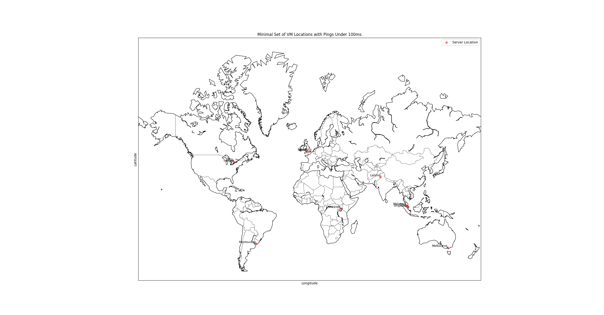

[Resume](../resume_page.md), [Projects](../projects.md), [Blog](../blog.md)

# Musings
Just a page where I dabble in partially formed thoughts. Getting them onto paper, or rather Web, so that I can more fully form them.

## Websites with Operating Hours
Why a website would have operating hours is more or less beyond me. But I've come across a handful of them. Websites that when access outside of "Normal Business Hours" will display a simple message asking you to come back during specific hours to access the site. I think this sticks in my mind because of how fast web hosting costs can increase. And how much money can be saved by simply cutting down the hours a site is operational during. Of course you always need to have something small running to serve the bare bones come back later message, but that can be handled by an extremely small server, and if you're doing this type of come back later you're likely already getting the vast majority of your traffic at specific times of day. 

I did try for awhile to do something by having a site which was served from a scalable instance that dropped to zero. The issue was that the site typically took far too long to boot up and people grew frustrated with the loading times being drawn out whenever they accessed a site for the first time in awhile. The issue of startup times might be addressed to some extend; however, I have serious doubts it could be gotten down below the 100-200ms that I find online is considered to feel "Instantaneous". Although firecracker vms are supposedly able to start up in under 125ms which is potentially sufficient to acomplish the instantaneous feel that's desired, if with minimal room. One thing I've considered is could a load balancer potentially allow a mix of both operating hours and faster startups. People don't need everything to arrive all at once, they just need it all to be there pretty fast and to start arriving within that timeframe. Potentialy caching the basics of the page and serving those before the actual system has fully started up.

Unfortunately I likely won't get to try out any of these alternate approaches as the system has settled onto a pretty good solution that fits within the needed cost point. The other issues here being that most of the potential methods for getting things setup to handle these ultra fast instant deployments are actually more expensive than simply running traditional virtual machines. 

## The Traveling VM
This is an idea that I've played with when considering the problem of keeping costs low on operating a website which is used throughout the world. If operating hours aren't going to work then the alternative would be to make a single small VM which travels around to be constantly during relative operating hours in the area that its serving. This way if someone is crazy and tries to access the site in the night from their location you can simply make them put up with a larger ping time as they have to access the service from across an ocean or something similar. This isn't actually a terrible idea although it has some downsides that make it not very appealing in a lot of situations.

- You need to have a travel plan for the VM. Say you want to maintain an average ping time of less than 100ms. This is doable; however your VM is going to need to hop from one place to another several times over the day to keep things functional. 
- My guess is that you'd need at least 6 different server locations to make the system function although global ping map data says that you need at least 9 servers to maintain sub 100ms ping times to everywhere on earth. 

- You'll notice that this is partially Latitude Dependent as well as Longitude dependent with server locations seperated Vertically as opposed to just Horizontally on the graph. This means that a basic traveling setup wouldn't really be practical. This means that potentially 3 sets of traveling VMs would get you a reasonable ping time during the day. You''ll notice as well that the servers are not properly evenly spaced. This is an unfortunate concequence of where the infrastructure is and how ping time doesn't equate cleanly to physical distance. There would definitely be a secondary problem that these VMs need to cleanly transfer data between one another (User updates when one comes online vs another), this would get expensive. Not just because the data transfer costs between data centers is typically not free, but because it would have a premium transferring in and out of specific cloud providers. 

Honestly based on these things I think the way for this to be handled is with Cloud Functions over entire websites. I once had a spike in cost because my ChatGPT thing was being used by some people in europe while I was deploying to the states. The data transfer costs were while not high, well above the free teir usage that I had expected. Based on this I would say that deploying a cloud function to each of these locations and giving them a small local storage is likely a very valid way to keep costs low. 

## Screaming into the Void at Geolocation Restrictions
So the internet was supposed to be some sort of international post borders utopia. You can be anywhere and enagage with content from anyone. Yeah languages exist, but if you learn the language of the area, nobody can really tell you're not a local. IP block were kinda the death of that idea. Now I understand why the internet is done this way. If anyone can have any IP address with no real consistency then I'm sure that assigning them would not be really practical. But now it means that I can tell where your coming form based on your IP address and I don't get to watch the netflix shows that I want. 

I spent way too long this morning dealing with the phone system, and it kind of got me comparing things to the NAT network translation that local networks do. Your phone number is kind of doing that at a broader scale. You have local area codes to divide up a small number of numbers, then you have a larger numebr of numbers when you consider country codes. If we had a second planet would we add a planet code to dial addresses that way. And this got me thinking about our IPV4 vs IPV6 and the direction the internet developed. Given we already have NATs on every house and country codes. It would almost make sense if we had more levels of domains and addresses were assigned in more layers. A country can have a full set of IPV4 addresses which it then nats to select different countries if you define an extra address. Think stargates using an extra chevron to dial outside the galaxy. This is essentially the system we've built even if we set it up in a way that we really don't like to admit. There is an alternate reality where network addressing developed in a much more heirarchical method and you literally just add blocks to start navigating higher and higher on the tree of the internet. 

How do we break the internets obsession with making everyone have borders. Well I can see a few ways. We find a way for us to get to where we want to go without telling people where we're from. What do I mean by this. We use network address translation so that we tell the outside world where our house is, but not what device in our home network is doing the talking. I can see you're coming from X internet address but that just corresponds to the IP of your house not the IP of your phone. If you add additional natting to a generic public IP that is not associated with you then you're effectively just walking your way to and from your house by layers. Congrats we've invented a simplified non-encrypted version of the ToR protocol. At least to my level of understanding. 

How does this violate the ideals of the internet. Well there are a few different ways in which it violates the ideals of the internet. This sort of reshuffling of the tech stack will not under any circumstances happen. It would be impractical for more reasons than can be counted. If I could go back and hit a few engineers on the head I'd of insisted on making the IPV6 protocol fully backwards compatible with IPV4 so that IPV4 addresses were just a subnet of the IPV6 address space and anything misisng those additional layers of bits were just directed there. I'm sure it would have been substantially more work for the initial setup of the protocol; however, we might live in a glorious IPV6 capable world. And if somehow we invent nano dust with networking we could still run the same address spaces just expanded. But really the core issue is that the internet was supposed to ease communication between devices. If 2 devices are on the "internet" they should be able to talk to one another. That's the idea. Every device should be accessible (if correctly authenticated) to every other device. Want to talk to your home printer. You just need the address and some form of authentication. That's kind of insane to think of in the world where everything in Natted; however, this is to my understanding the original idea. So how do we get back to that. 

Well how would we eliminate country codes. IPV6 and removing NATs on that communication. It would require taking security properly serious. But it is a theoretical possibility, and kind of a cool one. 

This has given me one project idea. 

**Phone Address Translation Through Twilio**.

Phone -- > Call Twilio --> AI Picks up and Asks who you'd like to be connected to. 
--> --> It sends you through to the end point forwarding your call along the translation. 

Is there any advantage. Not that I can see. However, in texting mode it would create a substantially improved version of a tool I saw during this whole ordeal. 

Text Number --> AI Asks who you'd like to be connected with --> Forwards or listens for texts --> Responds after some time that the line needs to be released or asks to release the "Line" 
Text Number --> Asks the AI for any Messages from a given company --> Looks at incoming texts and forwards the relevant ones back to you.
If Someone Else wants the same "Line" at the same time, the AI refuses to release the line until it becomes available. 

This could work as a more secure way to bypass the shared numbers for two factor authentication without giving up the full anonymity that must appeal to people. 

## Microcontroller as Everything
One thing that I've noticed as of late is the number of specialized chips that end up being more expensive than simply taking a microcontroller and programming it to fulfill the needed functionality. For instance a design I'm working on currently I need UART to USB conversion; however, instead of placing the UART to USB FTDI chip down and working with that established setup, my current plan is to take an RP2040 chip and use that instead. Essentially allowing me to also gain access to a second UART channel, as well as a plethora of GPIO. In this particular case I'm working with a low powered Microprocessor as well which uses its one USB port for OTG mode, and while it can be configured to overlap the serial port, it's simply convenient to just add a secondary port. Worst case scenario I gain a port whereby I can interact with the RP2040 over the UART and simplify the process of controlling IO.

