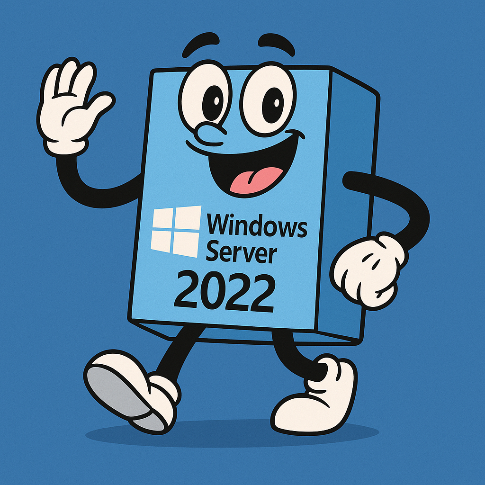
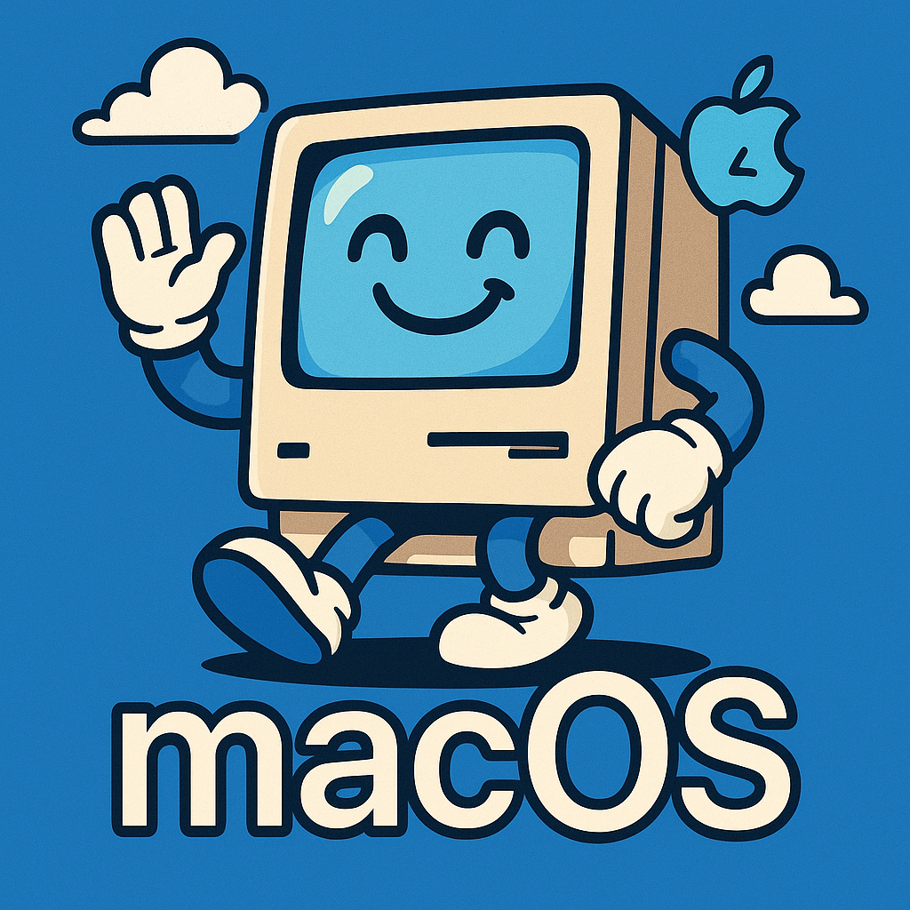

[Resume](../resume_page.md) [Projects](../projects.md), [Blog](../blog.md)

# Operating Systems I've Tried

I keep trying new Operating Systems recently and I figured I ought to start documenting them. Perhaps adding some initial thoughts on their comparative advantages. At time of initial writing I'm rocking out with Windows 11 Pro, Redhat 9, and macOS 14. But I've been learning some windows server while getting more skilled with macOS, and routing things through a VPN run on Raspbian. 

## Windows Server 2022

I've been trying Windows Server recently spinning up instances for a couple of hours at a time to explore what the system has to offer over either regular Windows or a more traditional linux based server. Powershell as always is not an amazing shell environment; however, with Windows essentially everything can be done through the various graphical interfaces. Theres a lot of good to be said for simply managed DNS servers and the like; however, the big challenge is if you can find the features you're actually looking for. At the price point, it's not necessarily a system that I'd recommend.

### AppV vs Remote App

Both of these exist as services on windows and sound from their descriptions like they're intended as alternatives to X11 forwarding on Linux systems. Quite frankly I think it's a great idea; however, I haven't been able to get either of these services set up. I had originally hoped to set it up to run something like Diptrace for me such that I could use my singular license across many locations without needing to go full remote desktop or deal with managing mulitiple libraries associated with the software. The issue appears to be that AppV is being obsoleted in favor of a Azure cloud solution, and Remote App appears to be so unpopular that Microsoft themselves often forget it exists.

- Remote App appears to be the actual solution for this type of setup, and I'm confident I could get it up and running given enough time to play with the Microsoft Server environment. Espeically if I could use real hardware as opposed to the virtulaized setup.

### CALS

Windows really loses a LOT of points with their licensing setup for Windows Server. Which quite frankly is a kind of silly distinction when most "Servers" are running linux and Windows is a secondary choice that appears to just have entrenched niches where people are too afaid of penguins. So Windows server does come with a lot of features; however, if you're thinking that everyone can share 1 super powerful windows machine you're going to be sorely dissapointed. Windows expects you to purchase client access licenses for everyone who needs to access the server.

So the pricing for Windows server works out like this:

| License | Quantitiy Needed | Price |
| :------- | :------: | -------: |
| Windows Server | 1/ 16 cores | ~$1,300~ |
| User CALs | 1/ User | ~$80 |
| RDS CALs | 1/ User | ~$320 |

This is an insane pricing structure that quite frankly I struggle to wrap my head around. Clearly they don't want you having a mainframe style setup where you have 1 powerful computer shared among employees. A system that would make a lot of sense for a lot of companies, especially in the modern world where things like remote work are becoming quit popular. Windows does have hyper-v so you could run seperate virtual machines on the singular windows server to create some division of setup, but that in a lot of ways feels like unneeded complexity. Still for around $10,000 you could setup a high-powered server which would manage a fleet of around 10 lower powered windows workstations that could be deployed using windows server as both hypervisor and manager. An RDS gateway could be setup to allow a group of employees to seemlessly connect up to their individual machines. You could even throw in some Linux server sif you happen to have the need and want to mix and match. 

## MacOS 14

An immediate point in favor of Mac is the fact that multiple VNC sessions are allowed in parallel making for a substantially smoother experience supporting multiple users over the headache that is Windows or Windows Server. The basic included office alternative suite known as iWork is also a major plus for anyone wanting to quickly and simply provision an office, especially one that doesn't rely on exchanging files with the rest of the world in terms of office's ubiquitous file formats. That being said I could see managing a fleet like this to be a relatively simple task, especially if one sets up a central server to run commands through. 

Going against good sense is OSx's lack of a good remote desktop system. Apple Remote Desktop may very well be a great application for all I know; however, it's not cross platform . It's not even internally cross platform which seems like a huge missed oprotuntity. Apple Remote Desktop can do some management on iPads and iPhones, but if it supported a full experience so that I could manage a fleet of iPhones and iPads from a Mac, that would almost make up for the lack of cross system support (Note that you can download Microsoft Remote Desktop on essentially any platform, and with Linux you can even serve a linux dekstop over RDP). VNC does work across platforms and allows remote control of Macs as I was initially impressed; however, it's painfully slow out of the box. I've seen some articles claiming that there are ways to speed it up; however, none that I've bothered to implement as of yet given it's too time consuming and my Mac is secondary machine.

## RHEL 
I bought my first RHEL license out of necessity; however, I'll likely buy a follow up license in my future out of convenience. All of the convenience of linux with a user interface that I'd feel fairly comfortable dropping a non-power user into without significant in advance training. I know a lot of the software development community is still up in arms about their "betrayal" of the Open Source community, and I do think it could have been handled better from a PR standpoint, I think it represents some necessary growing pains in the realm of open source software as companies and individuals battle things out for what is and is not fair. 

## Oracle Linux, Amazon Linux, Alibaba Linux
Like Amazon Linux, but without that weird coppery after taste you get when deploying to AWS. I don't know what originally prompted large cloud providers to hand over their own linux distributions but I can't lie and say that I'm not a serious fan of the practice. 

| Feature            | Amazon Linux                      | Alibaba Cloud Linux               | Oracle Linux                      |
| ------------------ | --------------------------------- | --------------------------------- | --------------------------------- |
| Vendor             | Amazon Web Services (AWS)         | Alibaba Cloud                     | Oracle Corporation                |
| Base Distribution  | CentOS/RHEL                       | CentOS/RHEL                       | Red Hat Enterprise Linux (RHEL)   |
| Primary Use Case   | Optimized for AWS environments    | Optimized for Alibaba Cloud environments | Enterprise environments with Oracle products |
| Kernel             | Custom AWS-tuned kernel           | Custom Alibaba Cloud-tuned kernel | Unbreakable Enterprise Kernel (UEK) |
| Package Management | YUM, RPM                          | YUM, RPM                          | YUM, RPM, DNF                     |
| Support            | Community support; paid support through AWS | Community support; paid support through Alibaba | Paid support from Oracle; some community support |
| Performance Tuning | Optimized for EC2 instances and AWS services | Optimized for Alibaba Cloud services | Optimized for Oracle hardware and software |
| Security Features  | SELinux, security updates via AWS | SELinux, security updates via Alibaba | SELinux, Ksplice for zero-downtime kernel updates |
| Container Support  | Amazon ECS, Docker                | Alibaba Container Service, Docker | Docker, Oracle Container Runtime  |
| Compliance         | Various industry standards supported | Various industry standards supported | Various industry standards supported |
| Lifecycle Management | AWS Systems Manager for patching and updates | Alibaba Cloud Management Console | Oracle Enterprise Manager         |
| Popular Applications | Optimized for AWS SDKs, tools, and services | Optimized for Alibaba Cloud SDKs and services | Oracle Database, Middleware, and Applications |
| Initial Release    | Amazon Linux 1: September 2010    | Alibaba Cloud Linux 2: 2020       | Oracle Linux 4: October 2006      |

They're twins, although I will say I think Oracle has the better showing here over the other two systems. I've used Amazon Linux in the cloud for awhile as a proxy server for getting my various systems out of natted environments for easy updates and management. Oracle Linux I downloaded and deployed briefly with Hyper V. Alibaba linux is still on my to try, just as soon as I have some form of need for the platform. 

## Vanilla OS
The slick Mac OSx vibes drew me into this distribution making me want to give it a try, if not on real hardware, as a simple Hyper-V VM. 
- After disabling secure boot (as always) Vanilla Os did in fact load on hyper-V; however it failed to install requiring a minimum of 50GB to install sucsessfully. 
- A quick remake of the VM to meet the minimal requirements and it failed to install again, this time with no specific reason just a generic message to "Contact the Devs". 

The system did allow me to look through some settings menues and it indeed looks like what it is. A gussied up Debian distro made to look like it might be at home on a Macbook. I will say I was dissapointed to not try it as the native compatibility with things like android makes it an intriguing option for bringing new life to old Macs. If it ran Apple applications out of the box, I'd say it was the perfect operaitng system for that particular application. 

## Custom Compiled Linux
I need to do Linux from scratch on an x86 machine: [Find it Here](https://www.linuxfromscratch.org/). The idea being that why use someone elses distribution when you can create your own by compiling the kernel yourself and gaining familiarity with the core of what makes linux linux. It's been on my TODO for a very long time now. That being said, I was able to recently compile Linux using [buildroot](buildroot.org) for a custom SBC design that I did up for a research project. The processs of repeatedly recompiling the linux kernel from scratch was admittedly incredibly slow and frustrating, but in the end I ended up with a linux binary that works on a small board using only 16MB of flash memory. Linux from scratch gets you a utility running on sub 1GB of storage, assuming that cloud providers allow provisioning disks that small you could run that system online for only $3 per month. 

## More to come as I have time to write!