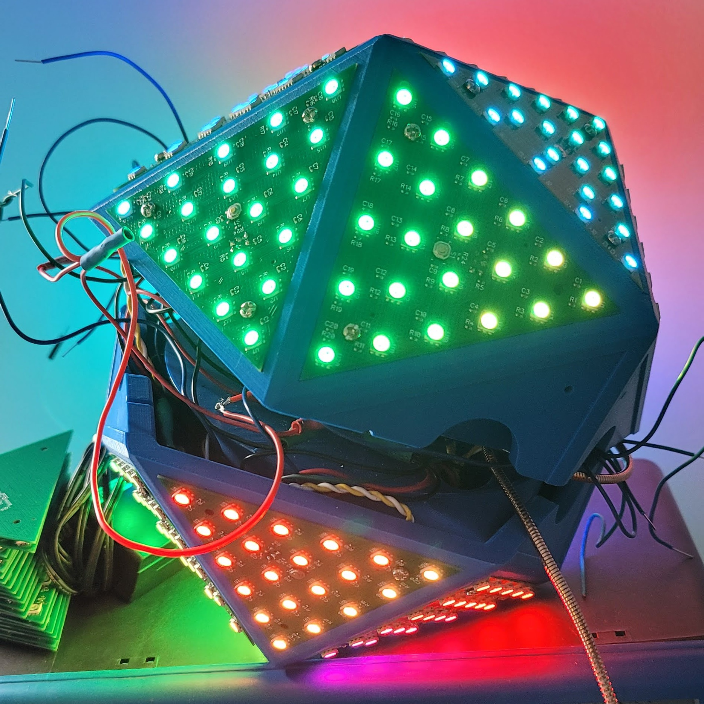

[Work With Me](..\..\resume), [Projects](..\..\projects), [Blog](..\..\blog)

# Icosahedron

This is my second time implementing this particular project. Still some polishing to do to get the top and the bottom together, although I may very well just move onto a version 3 to reduce the wire count being run between the two sides. Honestly that is my biggest regret with the project. I could probably get the two sides toegether wired up and programmed, but as I have to drive over an hour to get to where I can work on it, it's not a simple process to simplify the design down. This was one of the first larger pieces of PCBA I ordered from JLCPCB and there's definitely some improvements I'd do if I were completing the design again. 

[Single Panel Active](https://youtube.com/shorts/0LDtyrCgFoU)