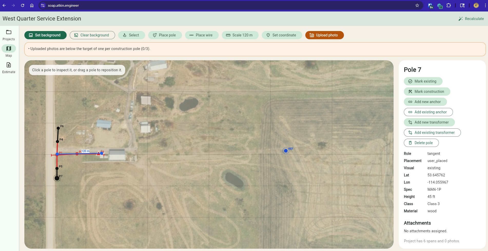

[Work With Me](..\..\resume), [Projects](..\..\projects), [Blog](..\..\blog)

# April 11th 2026 (Initial Creation)

Checkout my project SOAP here: [https://soap.atkin.engineer](https://soap.atkin.engineer). 
The idea of the project is to try and simplify the process of creating estimates for small scale distribution projects by making a user interface which can create rough construction drawings without any specialized knowledge. The export functionality is intended to be customized for a given service group so that this initial design setup can be integrated with later automations to minimize the amount of work required. 

The user sets up a basic project. They can use google maps or some other source to set the drawing background. They can then click to place poles on their drawing. They should set the drawing scale, the coordinate of at least 1 point on the map, and upload pictures along the line they want constructed. When they go to the estimate screen they get an extremely rough estimate of the project cost. By exporting that and sending it over to their powerline provider that provider can likely eliminate some work when preparing them an estimate. The hope is that they tip me $5 and go on their merry way having saved a few hundred to a few thousand depending on how well the powerline company can make use of the output drawing.