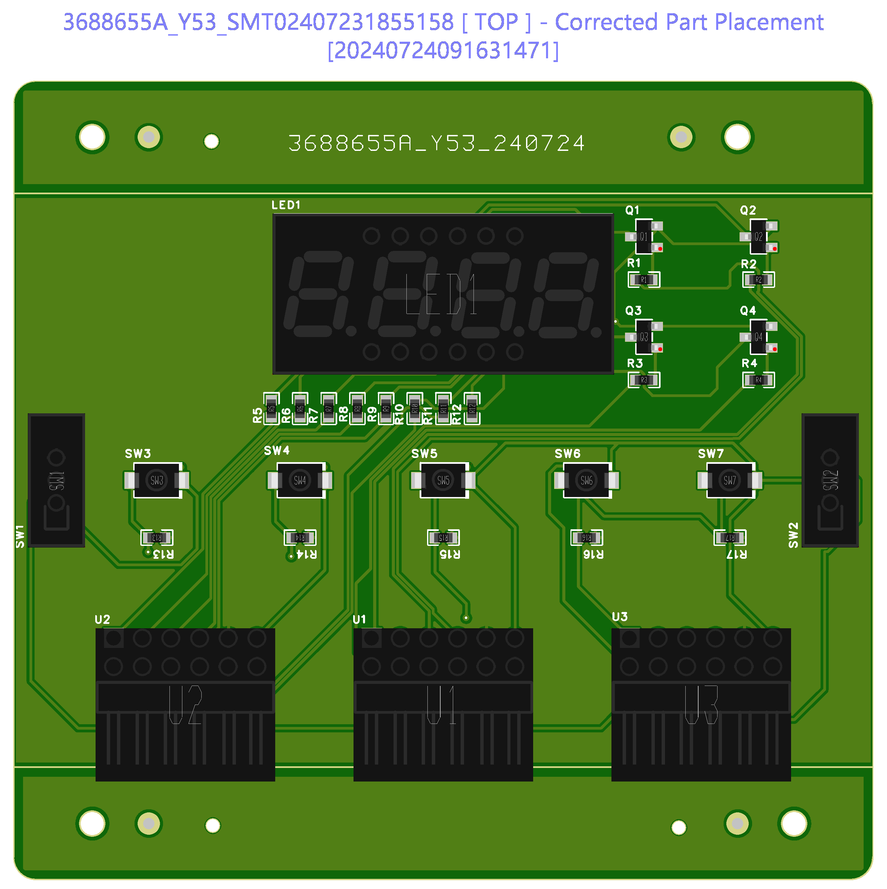

[Resume](..\..\resume), [Projects](..\..\projects), [Blog](..\..\blog)

# TT05 StopWatch Basic Test

I prepared this PMOD board and am having it fabricated with JLCPCB in order to effectively test my Tiny Tapeout 5 design. This design was primarily part of an educational effort and I'll likely be writing about it in more detail elsewhere down the road; however, I'll make sure to link back to here if that does indeed end up occuring. Without the PMOD it's quite annoying to test this design as it's based off of code that's intended to be run on the Basys 3 Board, and therefore has active low outputs for the anodes, and for the cathodes. With JLCPCB being as fast as it is to fabricate boards. This is a lot simpler, although more expensive to complete the testing. 
